---
title       : DublinR - Machine Learning
subtitle    : Machine Learning on Machines
author      : Eoin Brazil - https://github.com/braz/DublinR-ML-machine
job         : 
framework   : io2012        # {io2012, html5slides, shower, dzslides, ...}
highlighter : highlight.js  # {highlight.js, prettify, highlight}
hitheme     : tomorrow      # 
widgets     : []            # {mathjax, quiz, bootstrap}
mode        : selfcontained # {standalone, draft}
output:
  ioslides_presentation:
    widescreen: true
    smaller: true
--- 


## Machine Learning Techniques in R  

### How can you interpret their results?  

### A few techniques to improve prediction / reduce over-fitting  

### Nuts & Bolts - 2 data sets

--- &twocol

## Large scale computations in clusters

*** {name: left}

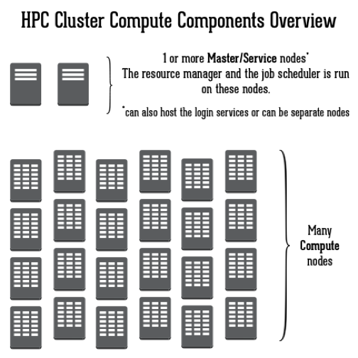 

*** {name: right}

- Large scale clusters have never been more available (e.g Azure, EC2, Bluemix, Compute Engine)
  - Even RStudio has an AMI (http://www.louisaslett.com/RStudio_AMI/). I used RStudio and an EC c4.4xlarge instance with it for many of these examples.
- Monitoring, collecting and interpreting the operational data from these hosts is useful to determine various aspects
 - Type of calculation / job
 - Utilisation of CPU


--- &twocol

## Type of calculation / job and Utilisation of CPU

*** {name: left}

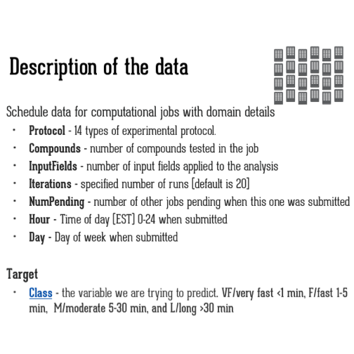 

*** {name: right}

 

--- .class #id bg:white

## Model Building Process
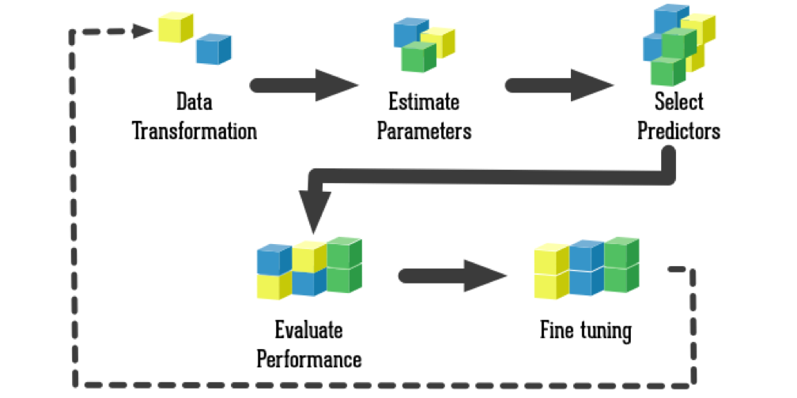 

--- .class #id bg:white

## Data Transformations

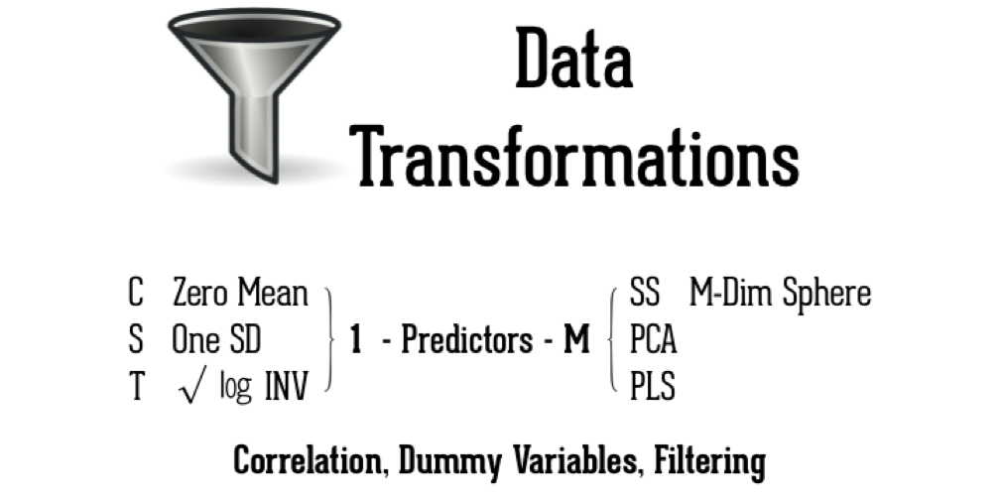 

--- .class #id bg:white

## Addressing Feature Selection
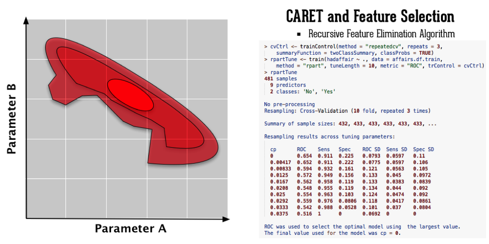 

--- .class #id bg:white

## Model Selection and Model Assessment
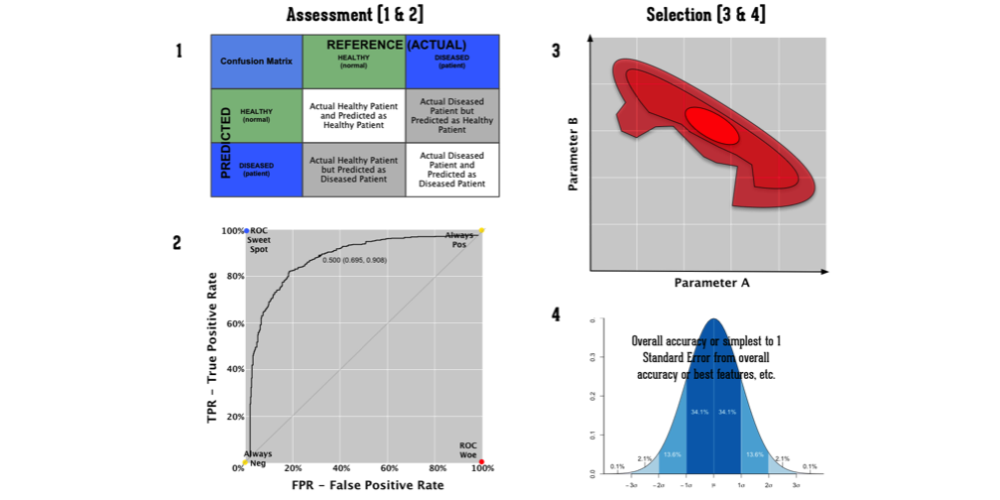 

--- .class #id bg:white

## Interpreting A Confusion Matrix

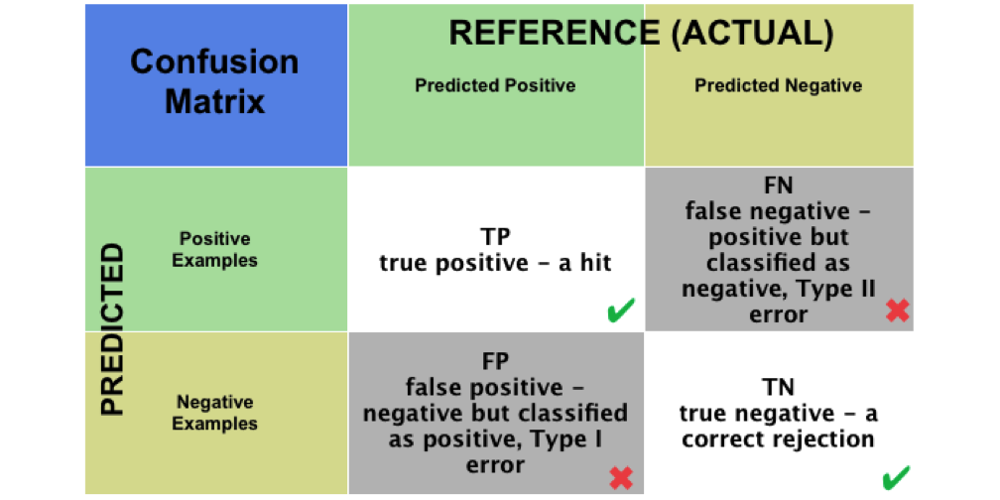 

--- .class #id bg:white

## Interpreting A Confusion Matrix Example

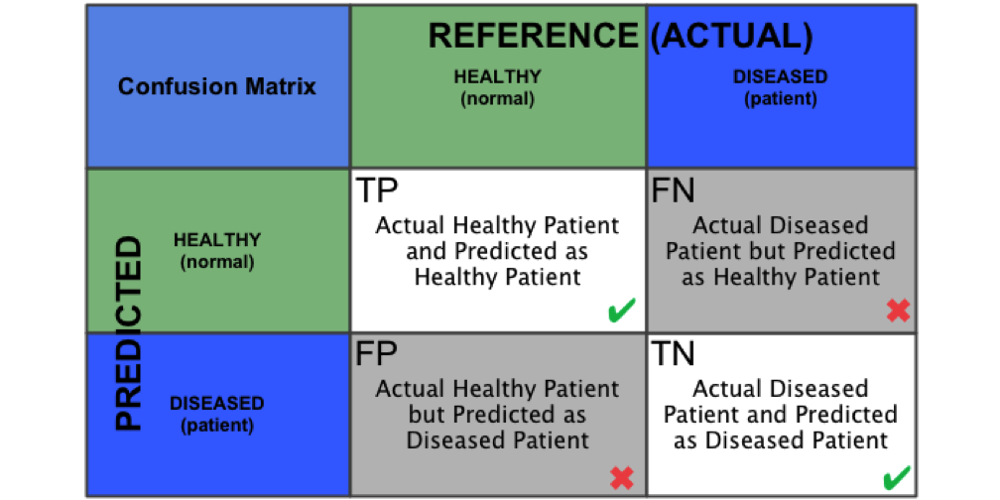 


--- .class #id bg:white

## Confusion Matrix - Calculations

 

--- &twocol

## Interpreting A ROC Plot

*** {name: left}

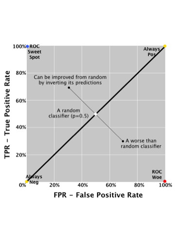 

*** {name: right}

  - A point in this plot is better than another if it is to the northwest (TPR higher / FPR lower / or both)
  - ``Conservatives'' - on LHS and near the X-axis - only make positive classification with strong evidence and making few FP errors but low TP rates
  - ``Liberals'' - on upper RHS - make positive classifications with weak evidence so nearly all positives identified however high FP rates

--- &twocol

## Addressing Prediction Error

*** {name: left}

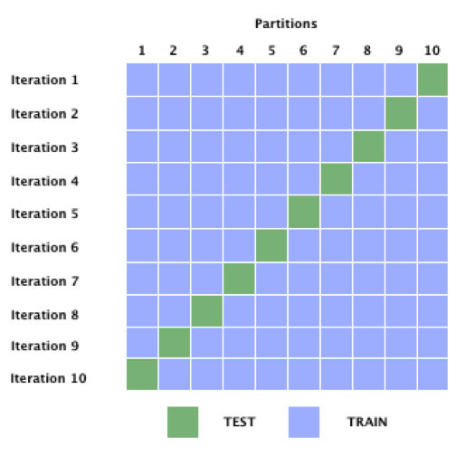 

*** {name: right}

- K-fold Cross-Validation (e.g. 10-fold) 
  - Allows for averaging the error across the models
- Bootstrapping, draw B random samples with replacement from data set to create B bootstrapped data sets with same size as original. These are used as training sets with the original used as the test set.
- Other variations on above:
  - Repeated cross validation
  - The '.632' bootstrap

--- .class #id bg:white

## Boosting / Bootstrap aggregation

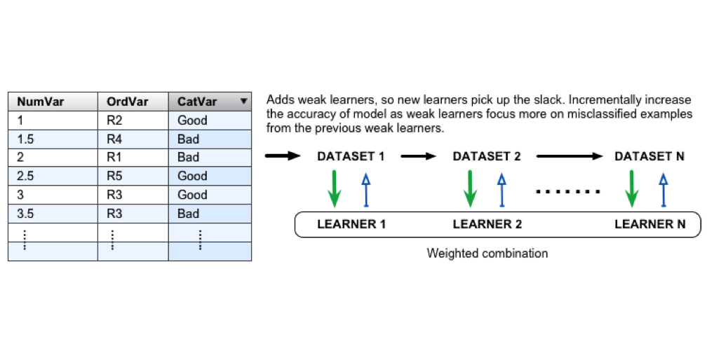 

--- .class #id bg:white

## Bagging

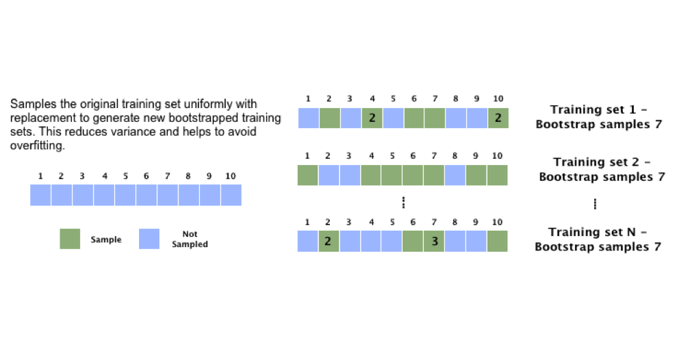 

--- .class #id bg:white

## Dataset 1 - Job Scheduling Data


```
##     Protocol      Compounds        InputFields      Iterations    
##  J      : 989   Min.   :   20.0   Min.   :   10   Min.   : 10.00  
##  O      : 581   1st Qu.:   98.0   1st Qu.:  134   1st Qu.: 20.00  
##  N      : 536   Median :  226.0   Median :  426   Median : 20.00  
##  M      : 451   Mean   :  497.7   Mean   : 1537   Mean   : 29.24  
##  I      : 381   3rd Qu.:  448.0   3rd Qu.:  991   3rd Qu.: 20.00  
##  H      : 321   Max.   :14103.0   Max.   :56671   Max.   :200.00  
##  (Other):1072                                                     
##    NumPending           Hour           Day      Class    
##  Min.   :   0.00   Min.   : 0.01667   Mon:692   VF:2211  
##  1st Qu.:   0.00   1st Qu.:10.90000   Tue:900   F :1347  
##  Median :   0.00   Median :14.01667   Wed:903   M : 514  
##  Mean   :  53.39   Mean   :13.73376   Thu:720   L : 259  
##  3rd Qu.:   0.00   3rd Qu.:16.60000   Fri:923            
##  Max.   :5605.00   Max.   :23.98333   Sat: 32            
##                                       Sun:161
```

--- .class #id bg:white

## Dataset 1 - Job Scheduling Data

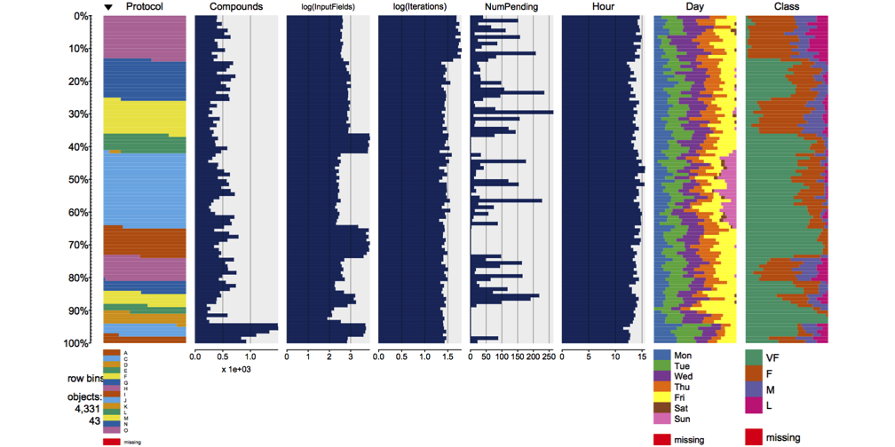 


--- .class #id bg:white

## Dataset 1 - Job Scheduling Data - Partitioning and Cost Matrix


```
## 'data.frame':	3467 obs. of  8 variables:
##  $ Protocol   : Factor w/ 14 levels "A","C","D","E",..: 4 4 4 4 4 4 4 4 4 4 ...
##  $ Compounds  : num  97 93 100 100 105 98 101 95 102 108 ...
##  $ InputFields: num  103 76 82 82 88 95 91 92 96 104 ...
##  $ Iterations : num  20 20 20 20 20 20 20 20 20 10 ...
##  $ NumPending : num  3 3 3 3 3 3 3 3 3 3 ...
##  $ Hour       : num  13.8 10.1 10.4 16.5 16.4 ...
##  $ Day        : Factor w/ 7 levels "Mon","Tue","Wed",..: 2 5 5 3 5 5 5 3 5 3 ...
##  $ Class      : Factor w/ 4 levels "VF","F","M","L": 1 1 1 1 1 1 1 1 1 1 ...
```

```
##    VF F M  L
## VF  0 1 5 10
## F   1 0 5  5
## M   1 1 0  1
## L   1 1 1  0
```

--- .class #id bg:white

## Dataset 1 - Job Scheduling Data - C50 Single Tree


```
## 
## Call:
## C5.0.formula(formula = Class ~ ., data = trainData)
## 
## Classification Tree
## Number of samples: 3467 
## Number of predictors: 7 
## 
## Tree size: 199 
## 
## Non-standard options: attempt to group attributes
```

```
##  Accuracy     Kappa 
## 0.8310185 0.7257584
```

--- .class #id bg:white

## Dataset 1 - Job Scheduling Data - C50 Cross-Validated (10 fold, repeated 5 times) - Part 1

```
## C5.0 
## 
## 3467 samples
##    7 predictor
##    4 classes: 'VF', 'F', 'M', 'L' 
## 
## No pre-processing
## Resampling: Cross-Validated (10 fold, repeated 5 times) 
## 
## Summary of sample sizes: 3119, 3120, 3122, 3120, 3120, 3120, ... 
## 
## Resampling results across tuning parameters:
## 
##   winnow  trials  Accuracy   Kappa      Cost       Accuracy SD  Kappa SD  
##   FALSE     1     0.8094026  0.6927055  0.3835011  0.01851659   0.03001178
##   FALSE    10     0.8345537  0.7318980  0.3442725  0.01469138   0.02393878
##   FALSE    20     0.8412999  0.7428217  0.3338396  0.01412315   0.02282365
##   FALSE    30     0.8406083  0.7416276  0.3359680  0.01431617   0.02292000
##   FALSE    40     0.8412987  0.7426118  0.3366641  0.01425873   0.02311093
##   FALSE    50     0.8426812  0.7449319  0.3318168  0.01246685   0.01998607
##   FALSE    60     0.8419952  0.7437531  0.3331911  0.01335949   0.02136949
##   FALSE    70     0.8423396  0.7443678  0.3319279  0.01406514   0.02248550
##   FALSE    80     0.8425691  0.7446598  0.3333175  0.01330740   0.02113161
##   FALSE    90     0.8422789  0.7442141  0.3343013  0.01415971   0.02252124
##   FALSE   100     0.8423924  0.7443888  0.3358031  0.01398184   0.02233801
##    TRUE     1     0.8098057  0.6932152  0.3849491  0.01873836   0.03039064
##    TRUE    10     0.8346130  0.7320788  0.3442159  0.01469821   0.02357808
##    TRUE    20     0.8407839  0.7419558  0.3338879  0.01427739   0.02320299
##    TRUE    30     0.8404354  0.7413244  0.3359104  0.01375501   0.02210552
##    TRUE    40     0.8409533  0.7420852  0.3360834  0.01393299   0.02265909
##    TRUE    50     0.8421632  0.7441460  0.3314100  0.01238113   0.01992140
##    TRUE    60     0.8416507  0.7432257  0.3328386  0.01318599   0.02115722
##    TRUE    70     0.8417629  0.7434720  0.3327311  0.01430716   0.02289839
##    TRUE    80     0.8418195  0.7434836  0.3338326  0.01354652   0.02157878
##    TRUE    90     0.8416452  0.7432490  0.3342393  0.01408687   0.02242716
##    TRUE   100     0.8421635  0.7440826  0.3351031  0.01386605   0.02215713
##   Cost SD   
##   0.04872469
##   0.04339505
##   0.04443300
##   0.04052638
##   0.04300273
##   0.03794953
##   0.03938278
##   0.04061954
##   0.03845357
##   0.03937890
##   0.03962993
##   0.04988016
##   0.04021917
##   0.04391880
##   0.03851951
##   0.04232472
##   0.03733955
##   0.03810535
##   0.04045743
##   0.03877106
##   0.03797577
##   0.03943262
## 
## Tuning parameter 'model' was held constant at a value of tree
## Cost was used to select the optimal model using  the smallest value.
## The final values used for the model were trials = 50, model = tree
##  and winnow = TRUE.
```

--- .class #id bg:white


```
##    model winnow trials  Accuracy     Kappa      Cost AccuracySD    KappaSD
## 1   tree  FALSE      1 0.8094026 0.6927055 0.3835011 0.01851659 0.03001178
## 12  tree   TRUE      1 0.8098057 0.6932152 0.3849491 0.01873836 0.03039064
## 2   tree  FALSE     10 0.8345537 0.7318980 0.3442725 0.01469138 0.02393878
## 13  tree   TRUE     10 0.8346130 0.7320788 0.3442159 0.01469821 0.02357808
## 3   tree  FALSE     20 0.8412999 0.7428217 0.3338396 0.01412315 0.02282365
## 14  tree   TRUE     20 0.8407839 0.7419558 0.3338879 0.01427739 0.02320299
## 4   tree  FALSE     30 0.8406083 0.7416276 0.3359680 0.01431617 0.02292000
## 15  tree   TRUE     30 0.8404354 0.7413244 0.3359104 0.01375501 0.02210552
## 5   tree  FALSE     40 0.8412987 0.7426118 0.3366641 0.01425873 0.02311093
## 16  tree   TRUE     40 0.8409533 0.7420852 0.3360834 0.01393299 0.02265909
## 6   tree  FALSE     50 0.8426812 0.7449319 0.3318168 0.01246685 0.01998607
## 17  tree   TRUE     50 0.8421632 0.7441460 0.3314100 0.01238113 0.01992140
## 7   tree  FALSE     60 0.8419952 0.7437531 0.3331911 0.01335949 0.02136949
## 18  tree   TRUE     60 0.8416507 0.7432257 0.3328386 0.01318599 0.02115722
## 8   tree  FALSE     70 0.8423396 0.7443678 0.3319279 0.01406514 0.02248550
## 19  tree   TRUE     70 0.8417629 0.7434720 0.3327311 0.01430716 0.02289839
## 9   tree  FALSE     80 0.8425691 0.7446598 0.3333175 0.01330740 0.02113161
## 20  tree   TRUE     80 0.8418195 0.7434836 0.3338326 0.01354652 0.02157878
## 10  tree  FALSE     90 0.8422789 0.7442141 0.3343013 0.01415971 0.02252124
## 21  tree   TRUE     90 0.8416452 0.7432490 0.3342393 0.01408687 0.02242716
## 11  tree  FALSE    100 0.8423924 0.7443888 0.3358031 0.01398184 0.02233801
## 22  tree   TRUE    100 0.8421635 0.7440826 0.3351031 0.01386605 0.02215713
##        CostSD
## 1  0.04872469
## 12 0.04988016
## 2  0.04339505
## 13 0.04021917
## 3  0.04443300
## 14 0.04391880
## 4  0.04052638
## 15 0.03851951
## 5  0.04300273
## 16 0.04232472
## 6  0.03794953
## 17 0.03733955
## 7  0.03938278
## 18 0.03810535
## 8  0.04061954
## 19 0.04045743
## 9  0.03845357
## 20 0.03877106
## 10 0.03937890
## 21 0.03797577
## 11 0.03962993
## 22 0.03943262
```

--- .class #id bg:white


```
## Cross-Validated (10 fold, repeated 5 times) Confusion Matrix 
## 
## (entries are un-normalized counts)
##  
##           Reference
## Prediction    VF     F     M     L
##         VF 164.6  17.1   1.7   0.2
##         F   11.8  83.6  11.6   1.7
##         M    0.4   6.2  27.0   2.1
##         L    0.1   0.9   0.9  16.8
```

```
##    VF F M  L
## VF  0 1 5 10
## F   1 0 5  5
## M   1 1 0  1
## L   1 1 1  0
```

--- .class #id bg:white

## Results of a variety of approaches focus on Cost metric
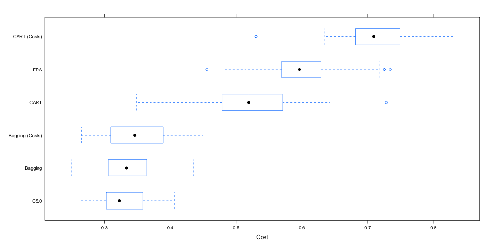 

--- &twocol

## Dataset 2 - CPU Burn Kaggle

*** {name: left}

 

*** {name: right}

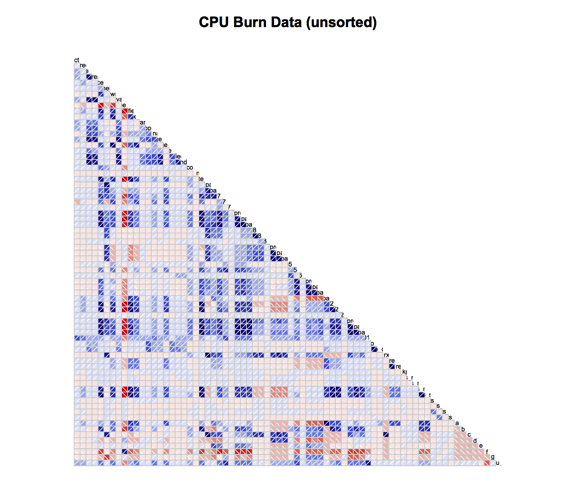 

--- .class #id bg:white

## Dataset 2 - CPU Burn Kaggle

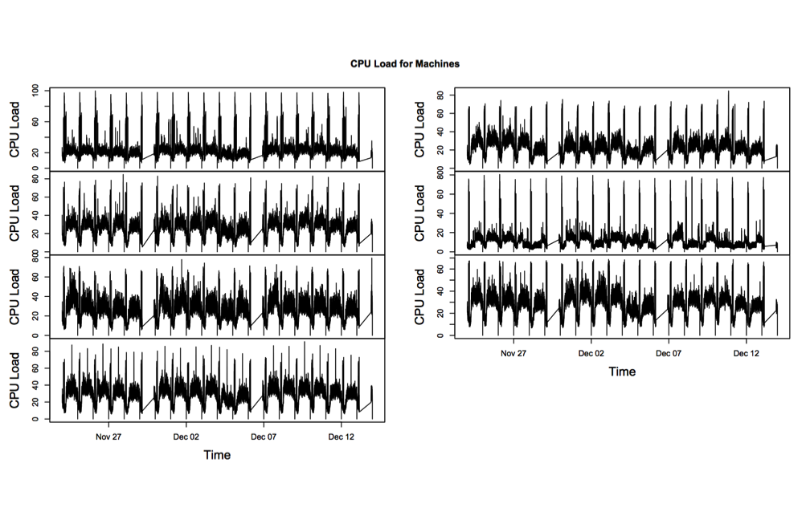 

--- .class #id bg:white

## Dataset 2 - CPU Burn Kaggle


```
##   syst_direct_ipo_rate syst_buffered_ipo_rate syst_page_fault_rate
## 1                80.48                1261.97                15.55
##   syst_page_read_ipo_rate syst_process_count syst_other_states
## 1                     2.1                271                12
##   page_page_write_ipo_rate page_global_valid_fault_rate
## 1                     6.23                         4.67
##   page_free_list_size page_modified_list_size io_mailbox_write_rate
## 1              138749                  100100                  7.98
##   io_split_transfer_rate io_file_open_rate io_logical_name_trans
## 1                      0              2.82                670.32
##   io_page_reads io_page_writes page_free_list_faults
## 1          4.02          15.25                  0.98
##   page_modified_list_faults page_demand_zero_faults state_compute
## 1                      0.35                    7.47             5
##   state_mwait state_lef state_hib state_cur sun mon tue wed thu fri sat
## 1           0       212        42         2   0   0   0   1   0   0   0
##   is_cpu_busy
## 1           1
```

--- .class #id bg:white

## Dataset 2 - CPU Burn Kaggle

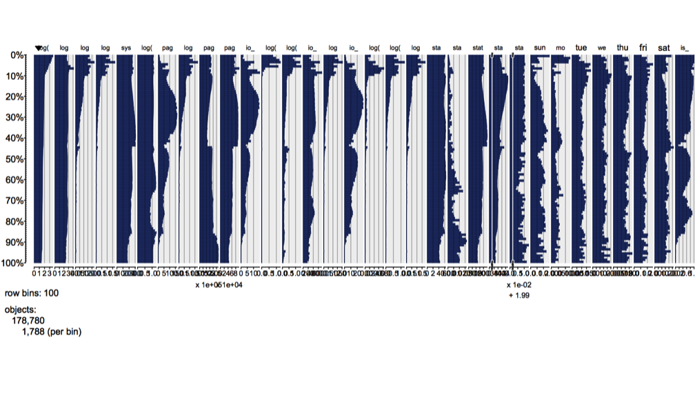 

--- .class #id bg:white

## Dataset 2 - CPU Burn Kaggle - Feature Selection 2


```
## [1] "nearZeroVar:"
```

```
##  [1] "syst_page_read_ipo_rate"      "page_page_write_ipo_rate"    
##  [3] "page_global_valid_fault_rate" "io_split_transfer_rate"      
##  [5] "io_page_reads"                "io_page_writes"              
##  [7] "page_free_list_faults"        "page_modified_list_faults"   
##  [9] "state_mwait"                  "state_cur"                   
## [11] "mon"
```

```
## [1] "high correlation .75+:"
```

```
##  [1] "syst_page_fault_rate"         "page_global_valid_fault_rate"
##  [3] "syst_page_read_ipo_rate"      "io_page_reads"               
##  [5] "page_modified_list_faults"    "page_free_list_size"         
##  [7] "page_modified_list_size"      "syst_process_count"          
##  [9] "page_page_write_ipo_rate"     "io_page_writes"
```

--- .class #id bg:white

## Dataset 2 - CPU Burn Kaggle - Feature Selection 2


```
## [1] "After removing nearZeroVar and high correlation .75+:"
```

```
##  [1] "syst_direct_ipo_rate"    "syst_buffered_ipo_rate" 
##  [3] "syst_other_states"       "io_mailbox_write_rate"  
##  [5] "io_file_open_rate"       "io_logical_name_trans"  
##  [7] "page_demand_zero_faults" "state_compute"          
##  [9] "state_lef"               "state_hib"              
## [11] "sun"                     "tue"                    
## [13] "wed"                     "thu"                    
## [15] "fri"                     "sat"                    
## [17] "is_cpu_busy"
```

--- .class #id bg:white

## Dataset 2 - CPU Burn Kaggle - Feature Selection 3


```
## [1] "Applying BoxCox, Centering, Scaling and PCA to data:"
```

```
## 
## Call:
## preProcess.default(x = cpuburn.data.df.reduced, method =
##  c("BoxCox", "center", "scale", "pca"))
## 
## Created from 178780 samples and 17 variables
## Pre-processing: Box-Cox transformation, centered, scaled,
##  principal component signal extraction 
## 
## Lambda estimates for Box-Cox transformation:
##    Min. 1st Qu.  Median    Mean 3rd Qu.    Max.    NA's 
##   -2.00   -0.65    0.70   -0.20    0.70    0.70      14 
## 
## PCA needed 15 components to capture 95 percent of the variance
```

--- .class #id bg:white

## Dataset 2 - CPU Burn - C50 Single Tree

```
##   syst_direct_ipo_rate syst_buffered_ipo_rate syst_process_count
## 4                68.75                 495.10                224
## 5                47.45                 436.65                253
##   page_page_write_ipo_rate page_global_valid_fault_rate
## 4                     2.58                          1.1
## 5                     2.48                          1.1
##   page_free_list_size page_modified_list_size io_page_reads io_page_writes
## 4              200705                   54727          0.93           8.18
## 5              176726                   69647          0.93           6.22
##   page_modified_list_faults is_cpu_busy
## 4                      0.13           1
## 5                      0.12           0
```

```
##      RMSE  Rsquared 
## 0.1998557 0.8284657
```

--- .class #id bg:white

## Results of Logistic Regression and PLS approaches 
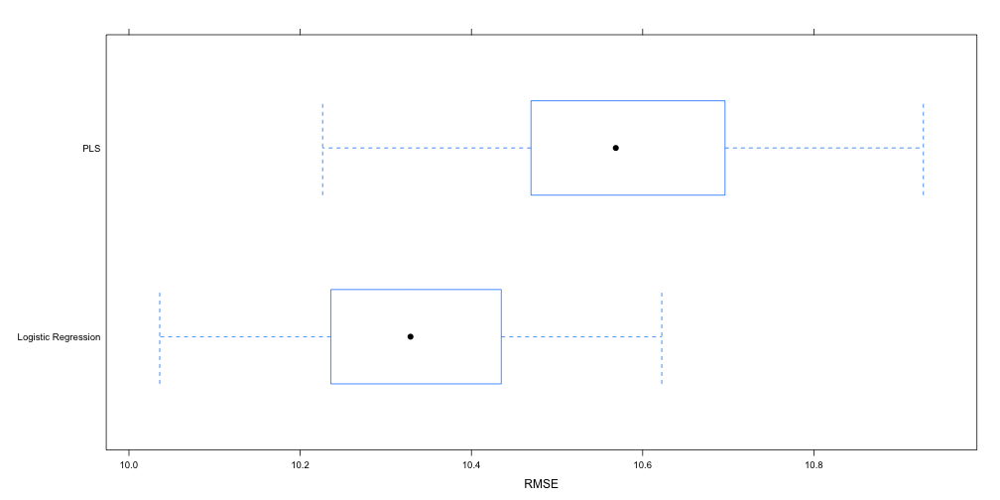 

--- .class #id bg:white

## Results of Random Forest approach 
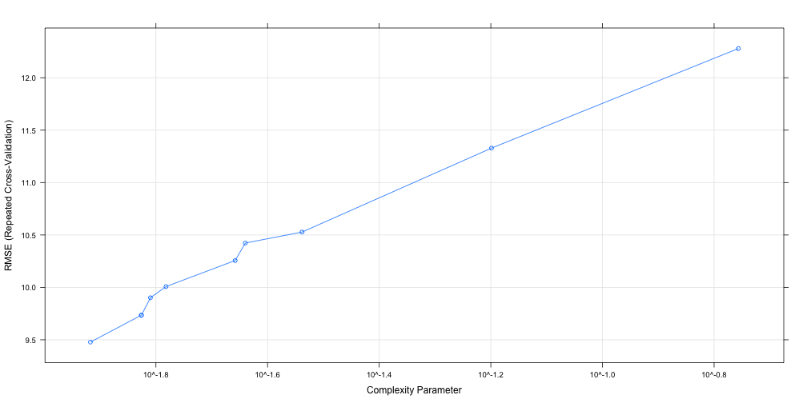 

--- .class #id bg:white

## In Summary

### An idea of some of the types of classifiers available in ML.

### What a confusion matrix and ROC means for a classifier and how to interpret them

### An idea of how to test a set of techniques and parameters to help you find the best model for your data

### Slides, Data, Scripts will be put up on GH:
#### https://github.com/braz/DublinR-ML-machines

--- .class #id bg:white

## Aside - How do decision trees work ?
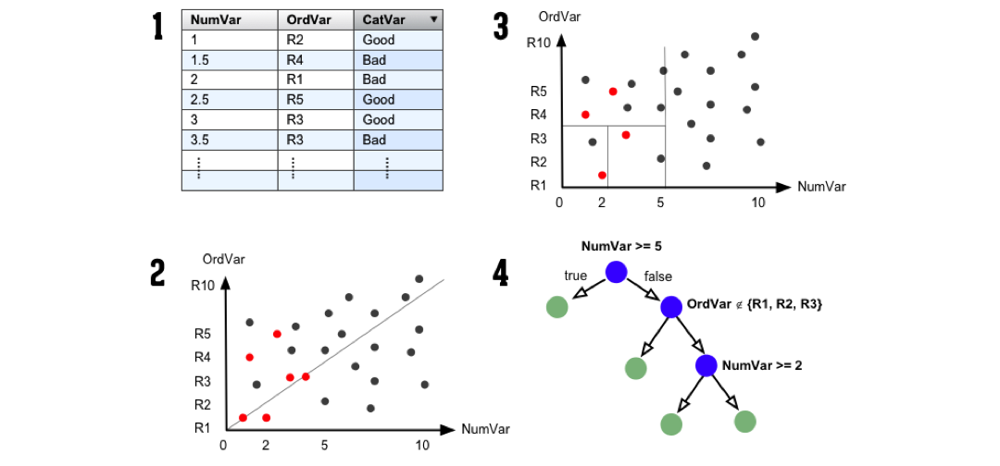 

--- .class #id bg:white

## Aside - How does a random forest work ?
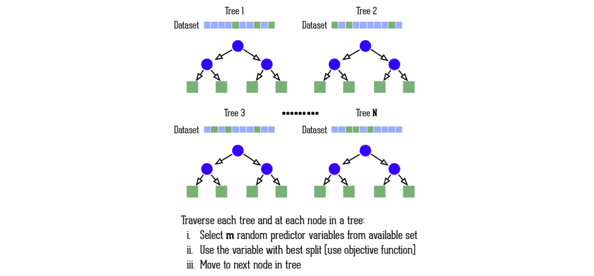 

--- .class #id bg:white

## Aside - How does k nearest neighbors work ?
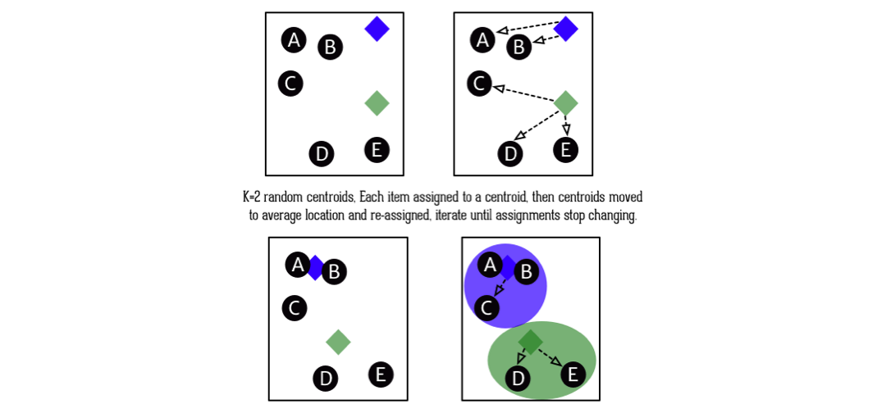 

--- .class #id bg:white

## Aside - How do support vector machines work ?
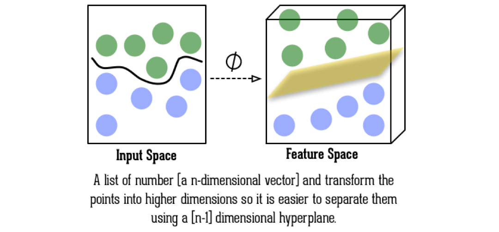 

